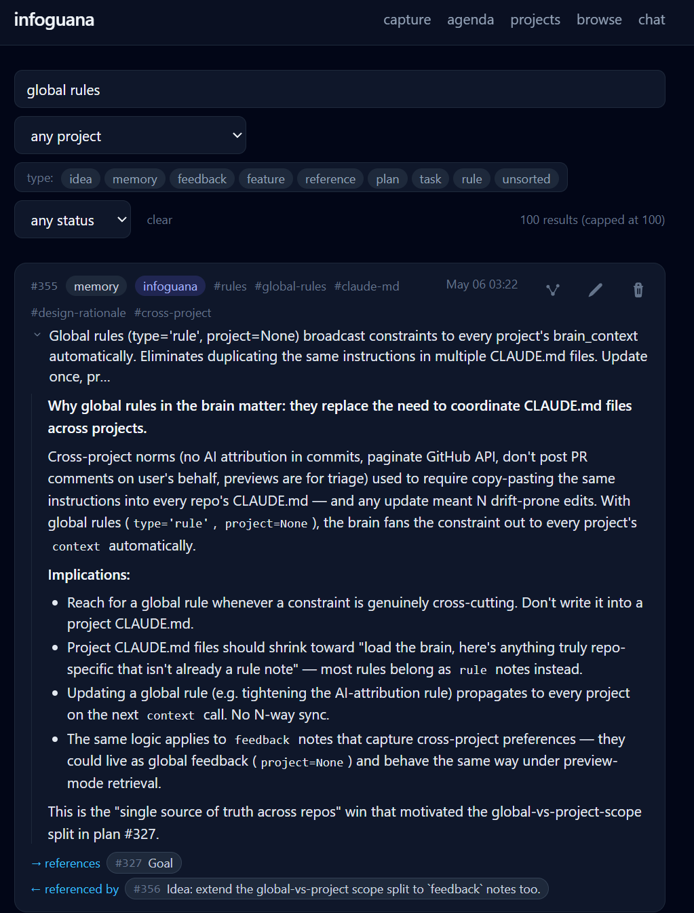
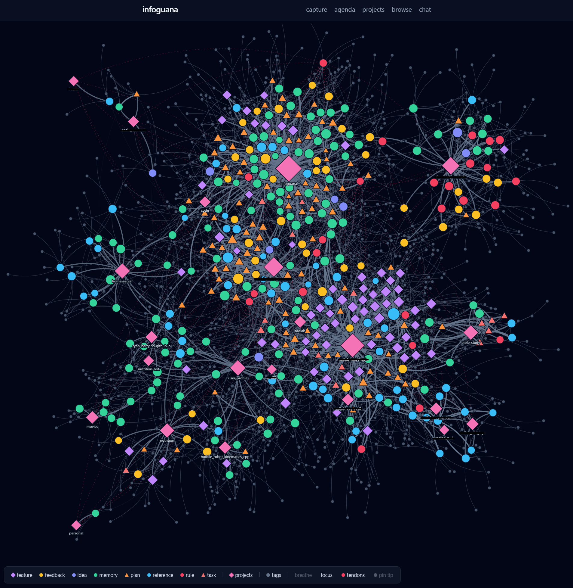
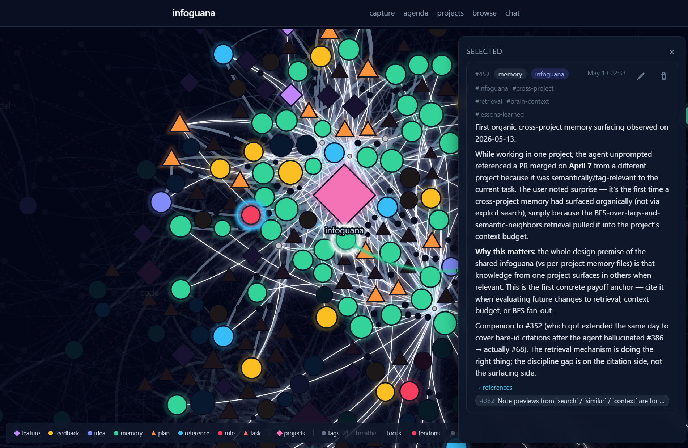

<div align="center">
  
</div>

Iguanas are ectotherms that depend on external heat to function.
Infoguana — *info* + *iguana* — gives LLM agents the same kind of
external lifeline: a cross-project memory with typed-graph notes,
hybrid retrieval, and MCP integration. FastAPI + SQLite (with
sqlite-vec + FTS5) + HTMX UI + MCP. Captures notes from phone/laptop,
classifies them through the Claude CLI or any OpenAI-compatible endpoint,
and serves them to any MCP-capable agent — Claude Code and Codex both
ship with an installer — so every agent, in every repository, is backed
by the same shared memory.

## How it works

Infoguana is a typed graph of short notes with hybrid retrieval, designed to
feed LLM agents only the slice of memory relevant to the current turn.

**Notes have types and tags.** Every note is one of `memory`, `feedback`,
`rule`, `skill`, `reference`, `plan`, `task`, `feature`, or `idea` — the type
changes how it's surfaced (e.g. `feedback` is sticky guidance the agent
should re-read, `plan` and `task` enter a lifecycle, `reference` is a
pointer). Tags are agent-curated at write time; `tag_suggest` ranks existing
vocabulary first so tags don't drift into singletons.

**Retrieval is hybrid and budgeted.** `search` fuses BM25 (FTS5) and cosine
similarity (sqlite-vec) over a single ranking. Hits come back as
**previews** — haiku-sized 1–5 line summaries generated at write time — so
an agent can triage 20 results for a few hundred tokens and only pull full
bodies (`get` / `get_many` / `expand_top=N`) for the ones worth quoting.

**SessionStart loads a layered, token-budgeted context pack.** On a new
session — Claude Code or Codex, both ship a hook — the agent's first
turn is packed with: a
**skill manifest** (one line per available skill — name, id, and trigger
condition — exempt from the token budget, with bodies fetched by id on
demand), **global-scope rules** (cross-project guidance the agent must follow
everywhere — "never reference infoguana note IDs in code", "previews are
for triage, not citation", etc. — a starter set ships pre-seeded on first
boot), **project-scope rules** (anything tagged to this specific project),
then **project memories** with **pending plans and tasks pinned at the
top** so outstanding work is the first thing the agent sees. Anything
else fills the remainder of the budget by IDF-weighted BFS relevance;
past the budget, it's dropped.

<div align="center">
  
  <br><sub><em>Search-and-filter view: combine a text query with type/tag/status facets across the corpus. Each hit expands to the full rendered note inline.</em></sub>
  <br><br>
</div>

**Skills live in infoguana, not in a per-harness skills directory.** A
`skill` note's body is a SKILL.md file verbatim — frontmatter and all — so
any client that can reach the MCP server gets the project's skills with no
harness-specific adaptation and no symlink farm per machine. Skills pin as
a *menu, not the meals*: one `name — description` line each, the
description being the trigger condition its author wrote rather than a
generated preview, and the agent calls `get(id)` — or `get_skill(name)`
when the user invoked one by name — for the body once it decides a skill
applies. A skill runs 4-8KB; three pinned in full would spend a whole
context budget before a single memory loaded. The manifest is exempt from
that budget and bounded separately, because a session that can afford no
memories still has to know which capabilities it has.

**Notes form a typed graph.** Edges carry meaning: `implements`,
`supersedes`, `references`, `caused_by`, `bundled_with`, `prerequisite_for`.
`traverse(start_id, edge_type)` walks design provenance; `search(...,
include_edges=True)` attaches neighbors inline so plan/decision lookups land
in one call. `context(project)` pre-walks an IDF-weighted BFS from pinned
anchors and packs the result into a token budget — that pack is what the
SessionStart hook hands the agent on turn one.

<div align="center">
  
  <br><sub><em>Full-graph view: nodes are notes (shape = type, color = type), the large pink diamonds are projects, edges are typed-edge connections plus IDF-weighted tag co-occurrences.</em></sub>
  <br><br>
</div>

**Plans and tasks are first-class.** `plan` and `task` notes share a
lifecycle (`not_started` → `pending` → `complete`) — plans are deliberate
units of work you want context on across sessions, tasks are smaller scoped
items. Both surface together: pending items for the current project are
pinned to the top of every `context()` call so outstanding work never gets
lost. `plan_complete(id, pr_urls=[...])` retires an item, attaches the PRs
that landed it, and can synthesize a `feature` note carrying lessons-learned.

**Updates are non-destructive.** Every `update` snapshots prior state and
bumps a version; `history(id)` returns diffs. Edges and audit rows survive
parent deletes via tombstones.

**Design history exports as an engineering notebook.** Once a feature lands,
`export(start_id)` walks the typed-edge graph from a root plan in both
directions (depth-bounded, `confirmed_only` by default so speculative agent
edges don't pollute the record), pulls in every linked PR, and spawns a
Claude synthesis pass to render the whole arc — original idea, the plan
that implemented it, the decisions it superseded, the bugs it caused, the
lessons-learned, the PRs that shipped — as one comprehensive markdown doc.
Output lives in `./data/exports/` and survives outside infoguana as a lab
notebook, audit trail, or onboarding handoff. See
[`docs/export/dashboard_table.md`](docs/export/dashboard_table.md) for a real
example — the design history of the `/projects` dashboard, walked from
plan to ship.

The net effect: an agent dropped into any project gets the right few
thousand tokens of context on its first turn (pinned plans + ranked
previews), can drill into the graph for design intent, can capture what it
learned without inventing new vocabulary, and the next session — possibly
in a different repo — sees that knowledge surface again.

<div align="center">
  
  <br><sub><em>Cross-project memory in action: while working in one project, the agent unprompted-ly surfaces a PR from a different project because the BFS-over-tags-and-semantic-neighbors retrieval pulled it into the current task's context.</em></sub>
  <br><br>
</div>

## Endpoints

- `GET /` — web capture UI (mobile-friendly)
- `GET /search/ui?q=` — hybrid BM25 + semantic search UI
- `POST /notes`, `GET /notes/{id}`, `PATCH /notes/{id}`, `DELETE /notes/{id}` — REST
- `GET /search?q=` — hybrid search JSON
- `POST /mcp/` — MCP Streamable HTTP (Bearer `$INFOGUANA_MCP_SECRET`)

## MCP tools

**Notes**
- `search(query, ...)` — hybrid BM25 + semantic search
- `similar(text, ...)` — pure semantic nearest-neighbor
- `recent(project?, limit?)` — latest notes
- `get(id)` / `get_many(ids)` — fetch by id
- `get_skill(name, project?)` — fetch a skill's SKILL.md body by its name
- `context(project, budget_tokens?)` — preview pack for an agent's first turn
- `history(id)` — version history (diffs across updates)
- `add(content, project?, type?, tags?, ...)` — save a note (auto-classified)
- `update(id, ...)` / `delete(id)` — edit / remove (snapshots prior state)
- `tag_suggest(text)` — rank existing tags for a note before write

**Plans**
- `plans(project?, status?)` — list tracked work (pending / in-progress / done)
- `plan_complete(id, pr_urls?)` — retire a plan; optionally synthesize lessons

**Graph**
- `link(from_id, to_id, edge_type)` / `unlink(...)` — typed edges
  (`implements`, `caused_by`, `supersedes`, `references`, `bundled_with`,
  `prerequisite_for`)
- `traverse(start_id, edge_type?, ...)` — multi-hop walk from a note
- `infer_edges(project?)` — suggest edges from co-citations / similarity
- `export(start_id, ...)` — render a note + linked design provenance as
  a markdown engineering notebook

**GitHub (read)**
- `gh_issue_get` / `gh_issue_list` / `gh_issue_comments`
- `gh_pr_get` / `gh_pr_comments`

**GitHub (write)**
- `gh_issue_create` / `gh_issue_comment_post` — gated by per-project bot PAT
  (`INFOGUANA_GITHUB_BOT_TOKENS`); refuses if no PAT configured for the
  project

**Filesystem (read-only, off by default)**
- `read_file(path, ...)` / `list_dir(path)` / `grep(pattern, ...)` — refused
  until `INFOGUANA_FS_ALLOWLIST` names the roots they may read under; see
  [DEPLOY.md](DEPLOY.md) for details

## Quick start (Docker)

Requires Docker with Compose (v2 recommended — it is what CI builds and
boots) and Python 3.10+ on the host. Works on Linux, macOS, and Windows.

```bash
git clone <this repo> infoguana && cd infoguana
cp .env.example .env                         # required: compose reads this file
docker compose up -d --build
python scripts/install-infoguana-mcp.py      # wires it into ~/.claude.json
docker compose exec infoguana claude /login  # optional: enables auto-classification
```

Auto-classification needs a backend, and there are two. The `claude
/login` above is one; the other is any OpenAI-compatible endpoint, set
with `INFOGUANA_CLASSIFY_BASE_URL` in `.env` (see `.env.example`). The
second is the path for an install with no Claude CLI on the host —
without either, notes are still saved, but they land untyped and
untagged.

On Linux/macOS, use `python3` if `python` isn't on your PATH.

No `.env` *editing* required — every setting has a default. The file does
have to exist, which is what the `cp` above is for; compose reads it and
refuses to start if it is missing. The container generates an MCP bearer on
first start, persists it under `./data/.mcp_secret`, and writes a
ready-to-paste `./data/mcp.json`. The installer merges that snippet into
`~/.claude.json` (idempotent; preserves your other `mcpServers` entries;
safe to re-run after a secret rotation).

If you're running infoguana on a different host than your Claude Code
machine, point the generated snippet at the right hostname:

```bash
cp .env.example .env                         # if you have not already
INFOGUANA_PUBLIC_HOST=infoguana.example.com docker compose up -d --build
python scripts/install-infoguana-mcp.py
```

After install, restart any open Claude Code sessions and run `/mcp list`
to confirm `infoguana` is connected.

See [DEPLOY.md](DEPLOY.md) for backups, updating, and optional knobs, or
[Troubleshooting](#troubleshooting) below for common bringup gotchas.

## Local dev

```bash
python3 -m venv .venv
source .venv/bin/activate
pip install -e .
python -m app.main
```

Then http://localhost:8789/. All settings have defaults; drop a `.env` in
the repo root to override (see `.env.example`).

## Auto-inject project context on first prompt

MCP gives the agent infoguana on demand, but it has to remember to call
`context` itself. To skip the cold-start step, install the `SessionStart`
hooks that ship with this repo — they pack the project's preview-mode
infoguana context directly into the agent's first turn, so architecture,
open work and hard rules are visible inline before answering anything.
At the default 4000-token budget that is roughly 25 note previews
alongside the rules and the skill manifest, which are sent in full and
are exempt from that budget. Budget for the first turn accordingly: the
whole pack measures 10k-20k tokens on a real corpus, most of it the
rules, so the 4000 bounds the memories rather than the injection.

```bash
python scripts/install-infoguana-hooks.py
```

The installer auto-creates `~/.infoguana.env` from the container's
`data/.mcp_secret` and `data/mcp.json`, then registers the hook entries
in `~/.claude/settings.json`. Re-running is idempotent and safe — other
vars in `~/.infoguana.env` (e.g. a custom `INFOGUANA_ONBOARD_BUDGET`)
are preserved on refresh.

That's it. Open Claude Code in any project and the first user message
auto-loads infoguana's project context.

## Using Codex instead of — or alongside — Claude Code

infoguana is not tied to one agent. The corpus is the durable thing; the
agent reading it is a free choice, and both can be installed at once so
you can switch without losing continuity.

```bash
python scripts/install-infoguana-codex.py
```

This writes a managed block into `~/.codex/config.toml` registering the
MCP server and a set of `SessionStart` hooks, and reuses the same
`~/.infoguana.env` the Claude Code installer creates — one credential
file, one server, one corpus. Everything outside the marker comments in
`config.toml` is preserved, so hand-edited settings survive re-runs.

It works because Codex implements a Claude-Code-compatible hook wire
format: a hook returning
`{"hookSpecificOutput": {"hookEventName": ..., "additionalContext": ...}}`
is understood by both, so `scripts/infoguana-onboard-chunk.py` serves
either agent unmodified. The hook adapts only its memory-override text, naming
whichever built-in memory store to leave alone; force it with
`INFOGUANA_AGENT=claude|codex` if autodetection guesses wrong.

**If you are upgrading an existing install**, edit the stored protocol in
the web UI once. Its opening line addresses the agent as Claude Code, and
it is seeded only when absent — your deployment kept the wording it was
first installed with, so a Codex session receives that opening alongside
the Codex-specific memory-override text and has to reconcile the two.
Fresh installs already carry agent-neutral wording.

Two steps remain that the installer can't do for you.

### 1. Give Codex the bearer token

For an HTTP MCP server, Codex does not read the token from
`config.toml` — it reads the environment variable named there
(`INFOGUANA_TOKEN`) from its own process, once, at startup. That's
a feature: your secret stays in `~/.infoguana.env` (mode 600) instead of
sitting in a config file. But it means the variable has to be set in
whatever launches Codex.

Add this to your shell startup file (`~/.bashrc`, `~/.zshrc`):

```bash
if [ -f "$HOME/.infoguana.env" ]; then
    . "$HOME/.infoguana.env"
    export INFOGUANA_TOKEN
fi
```

Note this is deliberately *not* `INFOGUANA_MCP_SECRET`, which is the
server's own variable. If you run the server with Docker Compose on this
same machine, exporting that name from your shell would feed the old
token back to `docker compose up` — so deleting `data/.mcp_secret` to
rotate the secret would silently leave the server accepting the token you
meant to revoke.

Then make Codex actually see it:

- **Running `codex` in a terminal** — open a new terminal. Done.
- **Running Codex as an IDE extension** — the extension inherits its
  environment from the editor process, which inherits from the shell
  that started it. Restart the editor. Reloading the window is usually
  *not* enough: with a remote/server setup (VS Code Remote-SSH, dev
  containers, Codespaces) the server process survives reloads and keeps
  its old environment. Kill the server and reconnect — in VS Code,
  *Remote-SSH: Kill VS Code Server on Host*.

If your shell startup file skips non-interactive shells (Debian's
default `~/.bashrc` starts with `[ -z "$PS1" ] && return`), an
IDE-launched process may not reach the block at all. Prefer telling your
editor directly — VS Code's `terminal.integrated.env.*`, a systemd user
environment, or the desktop entry that launches it — rather than moving
the block above that guard.

Moving it above the guard does work, but it puts the token in the
environment of *every* non-interactive shell on the machine: cron jobs,
git hooks, `ssh host <cmd>`, and any build or install script you run.
Each of those can read it from `/proc/<pid>/environ`, and tooling that
dumps `env` for diagnostics will write it to a log. That is a much wider
exposure than the mode-600 file it came from.

Check it landed — in a new terminal, and expect a non-zero length:

```bash
echo ${#INFOGUANA_TOKEN}
```

#### If the agent runs in a container

A dev container, Codespace, or any containerized agent talking to a
server on the host needs two things changed together — fixing only one
looks like a networking bug.

1. **The URL.** `localhost` inside a container is the container. Point
   the installer at the host and it writes that URL into both
   `config.toml` and `~/.infoguana.env`:

   ```bash
   INFOGUANA_URL=http://host.docker.internal:8789 \
       python scripts/install-infoguana-codex.py
   ```

   Use `host.containers.internal` under Podman. On Linux, Docker only
   provides `host.docker.internal` if you add
   `--add-host=host.docker.internal:host-gateway`; otherwise use the
   host's tailnet IP in preference to a LAN one — infoguana speaks plain
   HTTP, so on a LAN the bearer crosses the wire in cleartext and anyone
   who can observe that segment gets full read/write on the corpus. Over
   the container-to-host gateway or a tailnet, the traffic never reaches
   an untrusted network.

2. **The token, inside the container.** A shell startup file on the host
   is irrelevant to a process in a container. Pass it through — in
   `devcontainer.json`:

   ```jsonc
   "containerEnv": { "INFOGUANA_TOKEN": "${localEnv:INFOGUANA_TOKEN}" }
   ```

   or `docker run -e INFOGUANA_TOKEN`. The same applies to the
   `SessionStart` hook: its interpreter and script path must exist
   *inside* the container, so mount the repo (or skip the hook there and
   rely on MCP alone).

### 2. Approve the hook in Codex

Codex records a trust hash per hook and ignores hooks it hasn't been
told to trust, so the `SessionStart` hook stays inert until you accept
it in the Codex UI. Interactively, MCP tools work either way — the
auto-injected project context is what that trust gates.

Non-interactive `codex exec` is stricter, and the difference matters if
you script an agent: there, tool calls are refused outright with "user
cancelled MCP tool call" and hooks do not run, since neither approval
nor hook trust can be granted with nobody watching. Setting
`default_tools_approval_mode` (below) did not lift it in 0.145.0. The
escape hatches are `--dangerously-bypass-approvals-and-sandbox` and
`--dangerously-bypass-hook-trust`, which are as dangerous as they sound
— the first also disables sandboxing for model-generated shell commands.

### Stop the per-call approval prompts

By default Codex asks before each MCP tool call, which is tedious for a
memory server you query constantly. Set a server-wide default:

```toml
[mcp_servers.infoguana]
default_tools_approval_mode = "auto"
```

Accepted values are `auto`, `prompt`, `writes`, and `approve`. `auto`
never asks; `writes` is the middle ground, letting reads through and
asking before anything that modifies a note.

Approving a single tool from the Codex UI writes a *per-tool* override
that outranks this default:

```toml
[mcp_servers.infoguana.tools.search]
approval_mode = "approve"
```

If one tool keeps prompting after you set the default, that's why —
delete its `[mcp_servers.infoguana.tools.*]` table. Both this setting
and the hook-trust state Codex records are preserved when the installer
regenerates its block.

### Verify

`codex mcp list` should show infoguana with `Auth: Bearer token`, and
`codex doctor` reports a missing-env-var warning under `mcp` until step
1 takes effect.

## Wire up a project

For each project where your agent should use infoguana, drop a small
instruction file that tells it to consult infoguana on every task —
`CLAUDE.md` for Claude Code, `AGENTS.md` for Codex.
There are two ways to put one in place, depending on whether you want
the file committed or kept user-private:

### Option A — committed to the repo (`init-project-infoguana.py`)

Best when you're the only contributor or everyone on the team also uses
infoguana. The CLAUDE.md lands in the project root and gets tracked by
git.

```bash
python scripts/init-project-infoguana.py <project-name> [target-dir]
```

`<project-name>` is the key infoguana uses to scope notes (usually the
repo's directory name — keep it consistent so notes stay grouped). If
`[target-dir]` is omitted, the file lands in the current directory.
After writing, edit the generated file to fill in the one-line project
description and `<AUTHOR>` placeholder, then commit.

Each agent reads a different filename, so pass `--agent` to match yours:

```bash
python scripts/init-project-infoguana.py <project-name> --agent codex   # AGENTS.md
python scripts/init-project-infoguana.py <project-name> --agent both    # and CLAUDE.md
```

The default is `claude` (`CLAUDE.md`). The body is identical either way —
it only points at infoguana — so `both` is the right choice for a repo
whose contributors don't all use the same agent.

### Option B — user-private (the `infoguana-onboard` skill)

Best on shared / public repos where you don't want infoguana-specific
files in the tree. The skill writes CLAUDE.md into Claude Code's own
project data folder (`~/.claude/projects/<slug>/memory/CLAUDE.md` on
Linux/macOS, equivalent on Windows) where only your Claude Code session
sees it.

Nothing to install on a fresh deployment. `infoguana-onboard` ships as a
seeded **skill note**, inserted on first boot, so it reaches every client
that can talk to the MCP server rather than only the one whose skills
directory you copied it into. It appears in the `## skills available`
manifest at the top of each session; an agent that wants it calls
`get_skill('infoguana-onboard')` for the body.

The seeder leaves a database that already holds global skill notes alone,
so it will not pile the shipped set onto a curated one. If that is your
install, add it once by hand: paste `app/skill_seeds/infoguana-onboard.md`
into `add(type='skill')` with no project.

Then in any project, tell your agent: *"onboard this project to
infoguana"* — the skill fills in the project name, description, and
author from the repo context and writes the file.

---

In both options, the resulting `CLAUDE.md` tells the agent: use
infoguana's MCP for all memory in this project, scope every call to
`<project-name>`, treat previews as triage-not-citation, and defer the
full infoguana protocol to the SessionStart preamble.

## Troubleshooting

**`data/mcp.json not found` after `docker compose up`.** The container
entrypoint writes that file as it starts up. The installer waits up to 5
seconds for it to appear. If the host filesystem is slow (e.g. a network
share, WSL2 on a network drive), give it more time and re-run the
installer. The script is idempotent.

**`Couldn't find env file: .../.env`.** Compose reads `.env` and will not
start without it. Every setting has a default, so the file may be empty:

```bash
cp .env.example .env
```

**`docker compose logs infoguana` shows an old error after a rebuild.**
Compose can hold stale container state between rebuilds, especially when
the working directory changed since the last `up`. Force a clean recreate:

```bash
docker compose down
docker compose up -d --build
```

**Container restart loop with `exec /app/scripts/docker-entrypoint.sh:
no such file or directory`.** Line endings — your git checkout converted
the entrypoint to CRLF. The repo ships a `.gitattributes` that pins
`*.sh` to LF, but if you cloned before that landed or your git config
overrides it, re-clone (or `git rm --cached -r . && git reset --hard`).
The Dockerfile also strips `\r` from the entrypoint as a fallback.

**`PermissionError` reading `data/.mcp_secret` from the installer.**
Stale state from a pre-PUID/PGID container. The current entrypoint
chowns `/data` to the host user on every start, so rebuild + restart:

```bash
docker compose down
docker compose up -d --build
```

If that doesn't clear it: `sudo chown -R $USER:$USER data/`.

**`/mcp list` in Claude Code doesn't show `infoguana`.** Restart all
open Claude Code sessions after running the installer — the MCP client
config is read on session start, not refreshed live.
